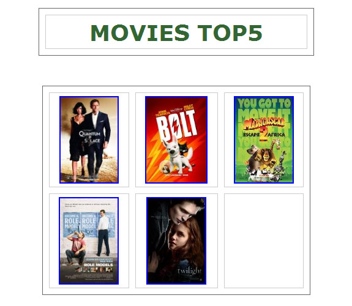
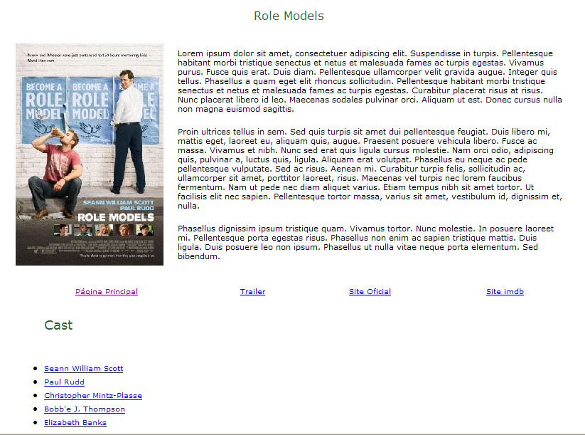
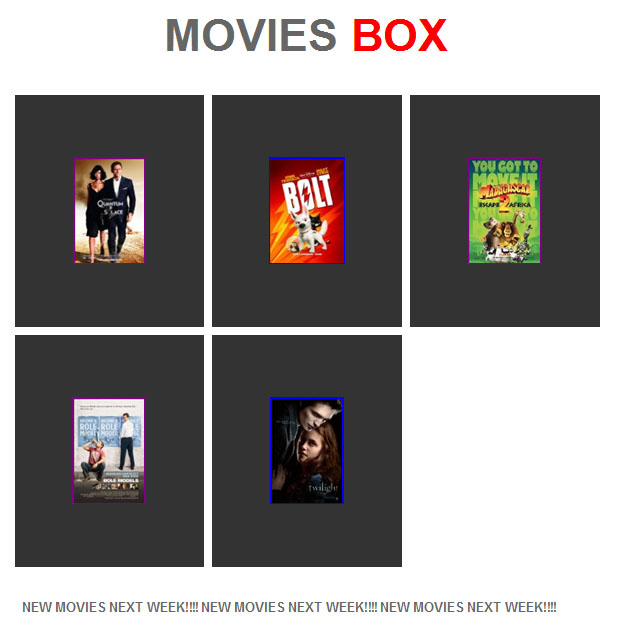
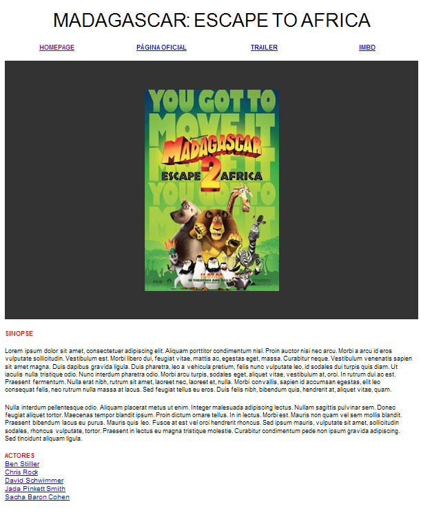

# 🎞 My Favorite Movies 🎞
## Goal 🥅
Create a website that showcases your favorite movies.
Feel free to use any movies you like.

## Specifications 🤓
* The website should contain an homepage `index.html` 
	* It should contain a Title `h1`
	* It should contain some thumbnail images that represent each of the movies you want to showcase.
	* That thumbnail should link to a html page, where you show the details of the specific movie.
	* Style at will with CSS
	* Optional: Feel free to add any other components you like to improve the website
* Movie Detail pages
	* Create an html page for each of your movies.
	* They should be similar in style but different in specific content.
	* The page should contain:
		* Title of the movie
		* Image with the movie poster
		* Description (feel free to use lipsum here)
		* Link to YouTube (or other site with the movie’s trailer)
		* IMDB.com link for the movie
		* List of main Actors, each linking to the actor’s IMDB page
		* Link to go back to the `index.html` page
		* Style at will with CSS
		* Optional: Feel free to add any other components you like to improve the website

## Examples 🍿
> For inspiration only. You should experiment with your own design.

### Example 1
#### Index

#### Detail pages

### Example 2
#### Index

#### Detail pages

